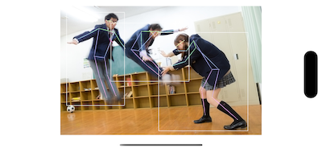

## News
<pre class="notranslate">
Developed a 100% Swift version
https://github.com/otmb/TopDownPoseEstimation
</pre>

## What is this
TopDown Pose Estimation on iOS

- BBox: Yolov7-tiny
- Pose Estimation: ViTPose


## Install

```
$ git clone https://github.com/mbotsu/TopDownPoseExample.git
$ cd TopDownPoseExample/TopDownPoseExample
$ curl -OL https://github.com/mbotsu/KeypointDecoder/releases/download/0.0.1/vitpose-b256x192_fp16.mlmodel
$ curl -OL https://github.com/mbotsu/KeypointDecoder/releases/download/0.0.1/yolov7-tiny_fp16.mlmodel
```

## Example



## References

- ViTPose to CoreML
    - [mbotsu/20221128_convert.ipynb](https://gist.github.com/mbotsu/3de024c36582f21306e23473e9975841)
- Yolov7 to CoreML
    - [john-rocky/CoreML-Models](https://github.com/john-rocky/CoreML-Models#yolov7) 
        - [Yolov7 Google Colab](https://colab.research.google.com/drive/1QiTlFsN948Xt2e4WgqUB8DnGgwWwtVZS?usp=sharing)

## COCO MS val set

[mbotsu/KeypointDecoder v0.0.5](https://github.com/mbotsu/KeypointDecoder/releases)  

```
Average Precision  (AP) @[ IoU=0.50:0.95 | area=   all | maxDets= 20 ] = 0.529
Average Precision  (AP) @[ IoU=0.50      | area=   all | maxDets= 20 ] = 0.679
Average Precision  (AP) @[ IoU=0.75      | area=   all | maxDets= 20 ] = 0.614
Average Precision  (AP) @[ IoU=0.50:0.95 | area=medium | maxDets= 20 ] = 0.479
Average Precision  (AP) @[ IoU=0.50:0.95 | area= large | maxDets= 20 ] = 0.614
Average Recall     (AR) @[ IoU=0.50:0.95 | area=   all | maxDets= 20 ] = 0.593
Average Recall     (AR) @[ IoU=0.50      | area=   all | maxDets= 20 ] = 0.702
Average Recall     (AR) @[ IoU=0.75      | area=   all | maxDets= 20 ] = 0.665
Average Recall     (AR) @[ IoU=0.50:0.95 | area=medium | maxDets= 20 ] = 0.528
Average Recall     (AR) @[ IoU=0.50:0.95 | area= large | maxDets= 20 ] = 0.684
```

|Model |AP| AP50 | AP75 | AP(M) | AP(L)|
|--|--|--|--|--|--|
| VitPose-b + Yolov7-tiny |  52.9 | 67.9 | 61.4 | 47.9 | 61.4| 
